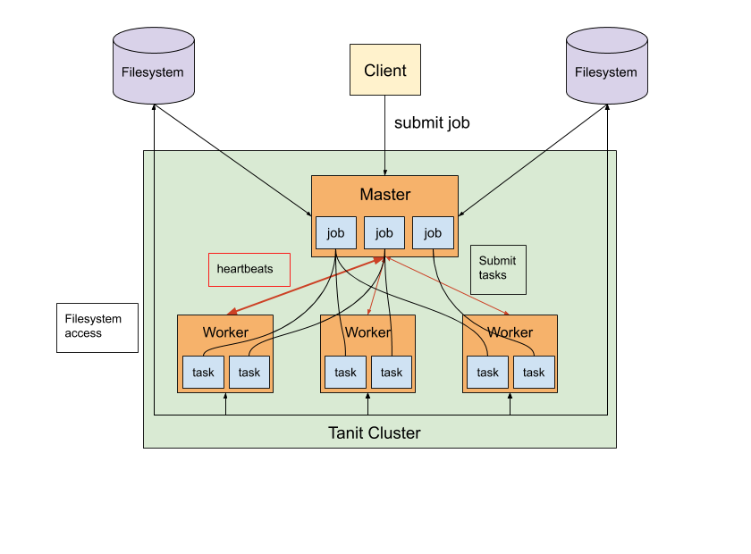
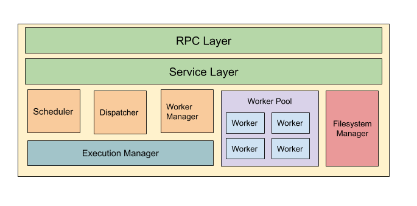
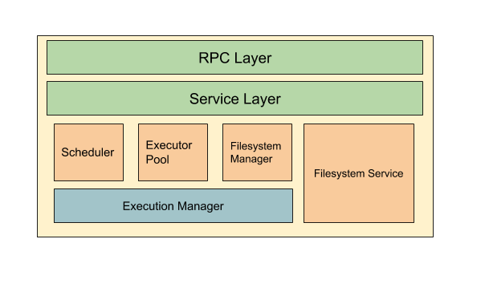
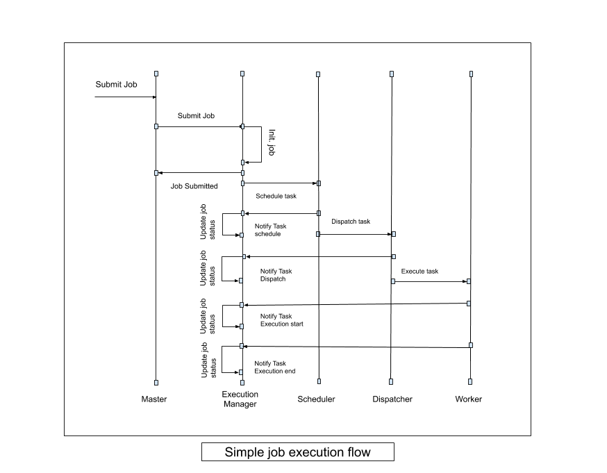
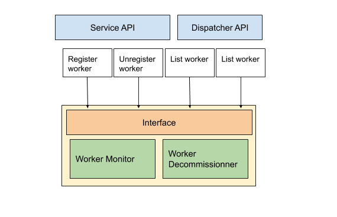
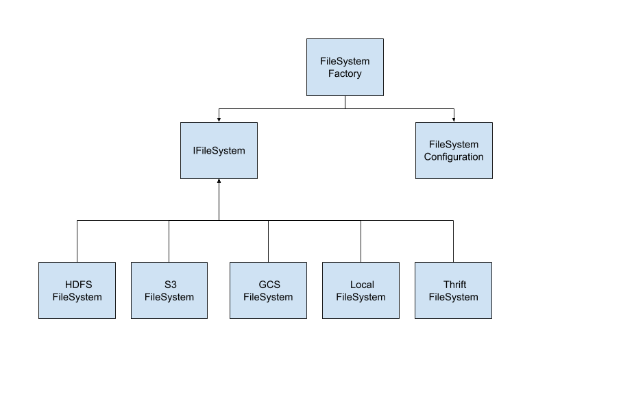

Architecture
==============

.. currentmodule:: tanit

Introduction
------------

Tanit is built using a distributed master/slave architecture. A cluster consists of a single master, that handle the transfer interactions with the client and manage jobs execution. In addition, there are multiple workers ,usually one per physical machine, which perform the actual data transfer between file systems.
Tanit expose a simple thrift interface that allows users to submit jobs, and behind the scenes the job is split into multiple tasks and handed to the workers who perform the actual execution.

A typical deployment has a single machine that runs the master service and multiple other machines that run the workers service. It is possible to run multiple instances of the worker in a single machine but that is not recommended and there is really no point in doing that.
Note that it is possible to run a worker on the master machine if necessary.

Master Service
---------------

The master service have four main responsibilities:

- Interact with external users.
- Manage jobs :
   - Scheduling jobs.
   - Dispatching tasks to workers.
   - Monitoring jobs execution.
   - Errors handling.
- Manage Workers :
   - Maintaining the list of workers.
   - Workers monitoring.
   - Blacklisting dead workers.
- Manage Filesystems :
   - Maintain the list of filesystems.
   - Notify workers in the cluster about new filesystems.

Worker Service
---------------

The worker service main responsibility is to execute the actual transfer tasks, and to interact with the master service to notify about task execution status.
Each worker also run an embedded thrift server that serve the local filesystem as a source or destination for data transfer.

Execution Manager
------------------

The execution manager is the component in the master service that manage the execution flow of jobs. Its main responsibilities are :

- Initialize jobs and split them into tasks.
- Schedule tasks for execution.
- Monitor jobs and tasks execution.
- Maintain the state of tasks and jobs.
- Restart failed tasks.

The above diagram show a simple successful job execution flow involving a single worker.

Scheduler
------------

The scheduler role is to order and prioritize the execution of incoming job tasks. The scheduler is designed as an independent component that pulls tasks from the 'call queue' and push them to the 'execution queue'.

Tanit supports two types of schedulers :

- FIFO scheduler : This is the default implementation, it simply push incoming tasks to a FIFO 'execution queue' following the order of their submission.
- Priority scheduler: Uses the assigned priority to each job/task to prioritize the task execution in the 'execution queue'. This uses a priority execution queue implementation, that pulls first the jobs with the highest priority.

Dispatcher
------------

The role of the dispatcher is to decide which node will execute each task. The dispatcher is also designed as an independent component that pulls already scheduled tasks from the 'execution queue', and decide which worker will run the task and submit it for execution.

.. note::
    The dispatcher does not monitor the execution of tasks once submitted, it simply just submit them for execution. Then it is the role of the execution manager to monitor the execution.

Tanit supports two types of dispatchers :

- Fair Dispatcher : Dispatch tasks to the least busy worker (the worker with less tasks).
- Tag Based Fair Dispatcher: This is a fair dispatcher but dispatch tasks only to workers having the same tag as the submitted jobs.

Worker Manager
---------------

The worker manager is the component that maintain the lifecycle of workers in the master.
Its main role is to monitor workers, and tell the dispatcher which workers are alive and available to execute jobs.
It also manage the process of decommissioning dead workers and notify the execution manager about failed tasks.

Filesystem Manager
-------------------

The filesystem manager is a central component in tanit, used by both the master and worker services. Its role is to expose a simple and common interface to interact with the different filesystems regardless of their type and implementation.

The filesystem manager uses a json configuration file to instantiate the file systems but it is also possible to create and remove filesystems at run time.

The currently supported filesystems are:

- Hadoop Distributed FileSystem (HDFS)
- Simple Storage Service (S3)
- Google Cloud Storage (GCS)
- Local File System via Direct Access or Thrift

.. note::
   Thrift Filesystem is a local filesystem service through a thrift service in each Tanit worker.
   This allows transferring data between the local filesystems of different workers.

References
---------------

source code: https://github.com/yassineazzouz/tanit